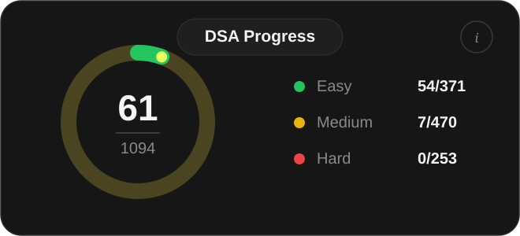

# Strivers A2Z DSA Sheet — Python Solutions

Python solutions to [Striver's A2Z DSA Course Sheet](https://takeuforward.org/strivers-a2z-dsa-course-sheet-2), organized topic by topic in the same order as the sheet — from basics through patterns, math, hashing, recursion, sorting, and arrays, with more topics added as I work through the list.

<p align="center">
  
</p>

## Solution format

Every problem is a self-contained `.py` file with a `Solution` class (LeetCode style) plus a quick sample call/example at the bottom so it can be run directly:

```bash
python "6-Arrays/Easy/1-Largest_elemet.py"
```

## Updating the progress card

The image above is generated from `generate_progress_svg.py`. To update it after solving more problems, open the file and edit the numbers at the top:

```python
CONFIG = {
    "easy_solved": 54,
    "easy_total": 371,
    "medium_solved": 7,
    "medium_total": 470,
    "hard_solved": 0,
    "hard_total": 253,
}
```

Then regenerate the card:

```bash
python generate_progress_svg.py
```

This rewrites `dsa-progress.svg` — commit it along with your changes and the README image updates automatically.
